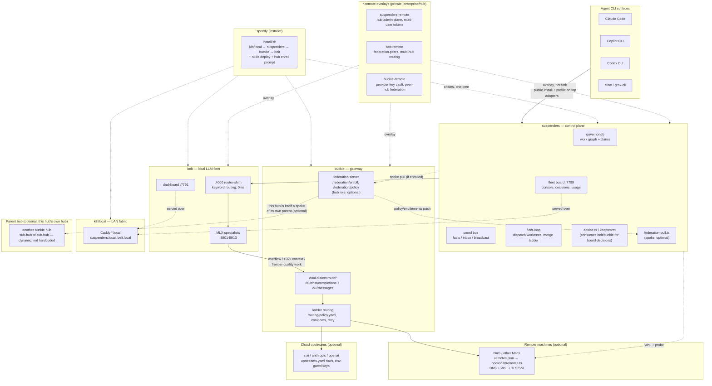

# The klh fleet — ecosystem overview

> This file is intentionally identical across `klh/speedy`, `klh/suspenders`,
> `klh/buckle`, `klh/belt`, and `klh/local` — whichever repo an agent or
> human opens first, the whole-system picture is one file away. Don't edit
> one copy without updating the other four; `klh/speedy`'s `install.sh`
> skills step also ships `klh-ecosystem-map` (a condensed, skill-formatted
> version of this same map) to `~/.claude/skills` on every install.

**speedy / suspenders / buckle / belt / klh-local are one system.** Five
repos because each layer has its own release cadence and its own license
(suspenders/belt are source-available BSL, buckle/local are MIT), not
because they're unrelated. Each of the three service repos (suspenders,
belt, buckle) also has a private, enterprise-only `*-remote` sibling
(`suspenders-remote`, `belt-remote`, `buckle-remote`) — an overlay, not a
fork, adding the hub/multi-user profile on top of the public base. See
[Hub + Spoke federation](#hub--spoke-federation--a-start-topology-not-a-fixed-one-optional)
below.

## The five repos

| Repo           | Role                                                                                                                                                    | Runtime location (after install)    | Key ports                                                                                                                   |
| -------------- | ------------------------------------------------------------------------------------------------------------------------------------------------------- | ----------------------------------- | --------------------------------------------------------------------------------------------------------------------------- |
| **speedy**     | Top-level installer/config layer — chains the other four in, installs skills, hooks, launchd agents.                                                    | the git checkout you installed from | —                                                                                                                           |
| **suspenders** | Control plane: governor.db work graph (SQLite/WAL), coord bus, fleet board, hook gates, fleet-loop (dispatch + merge ladder).                           | `~/.claude/hooks/suspenders`        | `:7799` board/console                                                                                                       |
| **buckle**     | LLM gateway: dual-dialect (OpenAI + Anthropic) pass-through, provider-as-data upstream pool, ladder routing, usage ledger, hub/spoke federation server. | `~/.claude/buckle`                  | `:4100` serving (today: litellm, cutover target: buckle itself) · `:4101` buckle shadow (pre-cutover)                       |
| **belt**       | The local LLM fleet: MLX specialists on localhost, keyword router, benchmark rig.                                                                       | `~/.claude/local-llm`               | `:8901` code · `:8902` extract · `:8903` reason · `:8906` danish/general · `:8912` kev · `:8913` rerank · `:7791` dashboard |
| **klh/local**  | LAN fabric: user-level Caddy serving `*.local` names over mDNS, zero sudo.                                                                              | `~/.local/bin/klh-local`            | `:80`/`:443` Caddy · `:7792` bar (registry dashboard)                                                                       |

## System map



## Call chain for an LLM request

1. An agent CLI (Claude Code, Copilot CLI, Codex, cline, grok-cli) makes a
   routed request — either directly to belt's router-shim (`:4000`,
   `ANTHROPIC_BASE_URL` override) or through suspenders' `advise.ts`
   (`SUSPENDERS_LLM_URL`, default `:8901`).
2. **belt**'s router-shim does 0ms deterministic keyword routing: short
   tasks/extraction → `:8902`, code → `:8901`, deep reasoning → `:8903`,
   Danish/multilingual → `:8906`, rerank → `:8913`.
3. Requests belt can't serve locally (>32k context, frontier-quality
   production work, or local fleet down) fall through to **buckle** — the
   dual-dialect gateway that picks a ladder rung (`routing-policy.yaml`):
   another local machine (via `remotes.json`), or a cloud upstream
   (`upstreams.yaml`, env-gated API keys, never committed).
4. **suspenders** sits alongside this path as the control plane, not in it —
   it governs work (the graph), coordinates sessions (coord bus), and shows
   the whole fleet's state (board), but doesn't route inference traffic
   itself except for its own advice-worker/keepwarm calls.

## Install vs. checkout — the split that causes "but I just fixed that!"

Every repo's `install.sh` **copies** the harness into a runtime home; it
does not run in place from the git checkout:

- suspenders → `~/.claude/hooks/suspenders` (`$SUSPENDERS_PREFIX`)
- buckle → `~/.claude/buckle`
- belt → `~/.claude/local-llm`
- speedy's skills → `~/.claude/skills` (symlinked at `~/.agents/skills`)

Editing a dev checkout has **zero runtime effect** until `install.sh`
re-runs and re-copies — launchd-managed daemons run the installed copy, not
the checkout. After merging a fix, re-run that repo's `install.sh` (or
speedy's, which chains all four) to actually deploy it.

## Remotes: reaching other machines

`hooks/lib/remotes.ts` (suspenders) reads the same runtime config belt's
swarm consumes: `~/.claude/local-llm/remotes.json` (never committed — real
hosts/IPs/MACs/keys stay local). Zod-validated, endpoint-level shape:

- `tls`/`base`/`api_key`/`api_key_env` live on each **endpoint**, not the
  machine — one machine can expose a plain-http LAN port and a
  TLS-fronted public one (e.g. a CDN-fronted z.ai-style endpoint needs the
  real hostname for SNI; a LAN NAS box resolves by IP).
- DNS-first resolution with `ip_fallback`; Wake-on-LAN (`mac` +
  `wol_broadcast`) for hibernating machines, gated so a 4-min keepwarm
  daemon never triggers a wake (that would defeat hibernation — only the
  rare, important routed call does).
- A malformed config fails loud (logs `z.prettifyError`, routes return
  empty) instead of silently mis-routing.

## Hub + Spoke federation — a start topology, not a fixed one (optional)

A **buckle** instance can run as a federation **hub**: `/federation/enroll`
mints a spoke a token from an admin-issued code; `/federation/policy` serves
the hub's policy manifest + model entitlements (echoed as a menu of what the
spoke may use). A **suspenders** install on another machine is the
**spoke**: `hooks/bin/federation-pull.ts` pulls that manifest on an
interval, caches last-known under `~/.claude/local-llm/`, and degrades
gracefully (hub unreachable = keep last-known, never block local routing).
speedy's `install.sh` asks once ("Do you want to buckle up and connect to a
belt hub?") and never re-prompts — standalone is the default.

**This is a starting topology, not the only shape.** A hub can itself be a
spoke of another hub — hubs have sub-hubs, dynamic and fault-tolerant, never
a single hardcoded relationship. belt-remote's `config/hub-profile.yaml`
carries a `federation.peers` list (empty by default, filled at runtime) —
the seam multi-hub routing hangs off.

### The `*-remote` overlay repos (private, enterprise/hub layer)

`klh/suspenders-remote`, `klh/belt-remote`, `klh/buckle-remote` are private
overlays over their public counterparts — **inheritance is one-directional**
(private depends on public via `package.json`; public repos never reference
anything `*-remote`). Overlay, not fork: a hub deploy = public base install

- the matching `*-remote` profile on top (config over code). They add:

* **suspenders-remote**: hub-profile defaults (auth ON, multi-user tokens,
  no local-MLX assumptions), the hub admin plane (token issuance/
  revocation per user+machine, provider-key management, federation status).
* **belt-remote**: multi-machine MLX fleet profile — registry federation
  with other hubs, hub-auth on every wire, multi-hub routing policy.
* **buckle-remote**: the hub gateway posture — multi-user auth tokens,
  provider-key vaulting behind admin control, federation to peer hubs,
  per-repo lane policies (must/prefer/hub/residency) enforced at the
  gateway.

Real hosts/keys for any of this live in `~/.config/klh/stack.yaml` (mode
600, OIDC/Entra tenant config included) — committed files carry
placeholders only (`hub.example`, `$ENV_NAME` refs).

## Discovery: `/llms.txt`

Every service in this stack serves a plain-text `GET /llms.txt`
self-description (endpoints, write contracts, companion repos) — check it
before guessing at an API:

- `http://suspenders.local:7799/llms.txt` (board/console, control plane)
- `http://belt.local:7791/llms.txt` (fleet dashboard)
- `http://bar.local:7792/llms.txt` (klh/local's own service registry)

## Coordination and work-graph CLIs (suspenders)

```
bun ~/.claude/hooks/suspenders/bin/coord.ts inbox --as <sid>     # read messages
bun ~/.claude/hooks/suspenders/bin/coord.ts fleet                # who's active
bun ~/.claude/hooks/suspenders/bin/work.ts  list                 # the work graph
bun ~/.claude/hooks/suspenders/bin/work.ts  take <id> --as <sid> # claim an item
```

Poll the coord inbox at session start and before finishing a task — this is
how the fleet hands off findings across sessions and machines (e.g. "W277
retired com.belt.gateway, don't re-enable it").

## When in doubt

If a task touches ECONNREFUSED, routing, a service being "down", ports, or
any question that spans more than one of these repos — check `/llms.txt`
and `coord fleet` **before** assuming a single repo's code is the whole
story.
